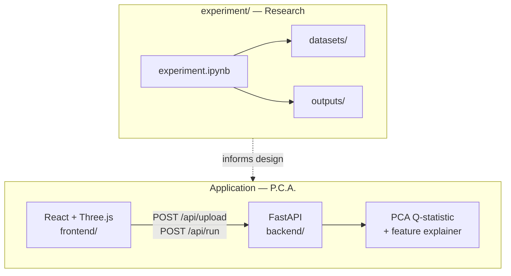

# Rethinking the Role of PCA

**It is a better anomaly detector than you might think.**

Cross-domain research on PCA-based anomaly detection (Q-statistic / SPE), paired with **P.C.A. — Peculiarity Catching Agent**, an interactive web app that puts the same idea in practitioners' hands.

---

## Overview

Most ML workflows treat PCA as preprocessing — compress features, then hand off to a separate detector. This project argues that **PCA itself**, used via the **Q-statistic (squared reconstruction error)**, is a credible first-class anomaly detector: fast, interpretable, and competitive with classical baselines on real data.

The repository has two independent parts:

| Part | Location | Purpose |
|------|----------|---------|
| **Research experiment** | [`experiment/`](experiment/) | Reproducible Jupyter study across five benchmark domains |
| **Web application** | [`backend/`](backend/) + [`frontend/`](frontend/) | Upload CSV → detect anomalies → explore in 3D |

They share the same core idea (PCA reconstruction error) but serve different goals: **evidence** vs **demonstration**.



---

## Research experiment

The standalone study lives in [`experiment/experiment.ipynb`](experiment/experiment.ipynb).

### What it does

- Compares **PCA (Q-statistic)** against **KNN**, **K-Means**, and **One-Class SVM** on five domains:
  - Finance — Credit Card Fraud
  - Healthcare — Thyroid (ann-thyroid)
  - Industrial — Shuttle (Statlog)
  - Cybersecurity — NSL-KDD
  - Manufacturing — SECOM
- Trains all detectors on **normal samples only**; labels are used for evaluation only.
- Reports PR-AUC, ROC-AUC, F1, timing, and PCA-specific diagnostics (k/d ratio, Q-score histograms).
- Explains *when* PCA wins or loses in terms of **data geometry** (Section 7).

### Thesis (in one sentence)

> PCA is a better anomaly detector than you might think **when anomalies violate a low-dimensional linear correlation structure** — not universally, but in more practically relevant domains than the "PCA is just preprocessing" narrative suggests.

### Quick start

**Requirements:** Python 3.11+

```bash
cd experiment
pip install -r requirements.txt
jupyter notebook experiment.ipynb
```

Run all cells top-to-bottom. Figures are written to `experiment/outputs/` (created automatically).

### Data

Benchmark CSVs ship under [`experiment/datasets/`](experiment/datasets/):

```
experiment/datasets/
├── creditCard.csv
├── thyroid.csv
├── KDD.csv
├── semiCom.csv
└── statlog/
    ├── shuttle.trn
    └── shuttle.tst
```

The notebook resolves `DATA_DIR` to `datasets/` automatically. No absolute paths are printed at runtime.

---

## Web application — P.C.A.

**Peculiarity Catching Agent** is a full-stack demo: upload a numeric CSV, run PCA-based anomaly detection, rotate a 3D scatter of the first principal components, and inspect per-row feature contributions.

### Features

- CSV upload with optional label column (0 = normal, 1 = anomaly)
- Auto or manual PCA component count; configurable threshold percentile
- Interactive **Three.js** 3D view (green = normal, red = anomaly)
- Anomaly table with top contributing features per row
- Download cleaned (normal-only) or anomaly-only CSV exports
- Built-in sample presets (`frontend/public/presets/`)

### Stack

| Layer | Technology |
|-------|------------|
| Backend | FastAPI, scikit-learn, pandas |
| Frontend | React 18, Vite, Three.js |
| Detection | PCA Q-statistic + per-feature residual explainer |

### Project structure

```
.
├── experiment/                 # Standalone research (notebook + datasets)
│   ├── experiment.ipynb
│   ├── requirements.txt
│   └── datasets/
├── backend/
│   ├── app/
│   │   ├── main.py             # FastAPI entrypoint
│   │   ├── config.py
│   │   ├── api/
│   │   │   ├── routes.py       # /api/upload, /api/run, downloads
│   │   │   └── schemas.py
│   │   └── services/
│   │       ├── data_loader.py
│   │       ├── pca_anomaly.py  # PCA fit, Q-score, threshold
│   │       └── explainer.py    # Per-row feature contributions
│   └── requirements.txt
├── frontend/
│   ├── src/
│   │   ├── App.jsx
│   │   ├── components/         # Upload, controls, 3D, table, downloads
│   │   └── api/client.js
│   └── package.json
└── scratch/
    └── generate_presets.py     # Utility to regenerate demo CSV presets
```

### Run locally

Use **two terminals** from the repository root.

#### Terminal 1 — Backend

```bash
cd backend
python -m venv .venv

# Windows (PowerShell)
.\.venv\Scripts\Activate.ps1

# macOS / Linux
source .venv/bin/activate

pip install -U pip setuptools wheel
pip install -r requirements.txt
python -m uvicorn app.main:app --reload --host 127.0.0.1 --port 8000
```

API docs: [http://localhost:8000/docs](http://localhost:8000/docs)

#### Terminal 2 — Frontend

```bash
cd frontend
npm install
npm run dev
```

Open [http://localhost:5173](http://localhost:5173). Vite proxies `/api` to the backend.

### Usage flow

1. **Upload** — Select a CSV with numeric feature columns. Optionally name a label column (`0` = normal, `1` = anomaly) so PCA fits on normal rows only.
2. **Configure** — Set component count (or leave auto) and threshold percentile (default 95).
3. **Run** — Detection executes; the 3D view and anomaly table populate.
4. **Explore** — Drag to rotate, scroll to zoom. Click rows in the table for detail.
5. **Export** — Download normal-only or anomaly-only CSVs.

### API reference

| Method | Endpoint | Description |
|--------|----------|-------------|
| `POST` | `/api/upload` | Upload CSV (`multipart/form-data`: `file`, optional `label_column`, `encoding`) |
| `POST` | `/api/run` | Run detection (`n_components`, `threshold_percentile`) |
| `GET` | `/api/download/cleaned` | Export rows labelled normal |
| `GET` | `/api/download/anomalies` | Export rows labelled anomalous |

Interactive schema: [http://localhost:8000/docs](http://localhost:8000/docs)

---

## How the two parts connect

| | Experiment notebook | Web app |
|---|---------------------|---------|
| **Goal** | Rigorous cross-domain comparison | Interactive exploration of one dataset at a time |
| **Methods** | PCA, KNN, K-Means, OC-SVM | PCA Q-statistic only |
| **Output** | Metrics, plots, geometric analysis | 3D viz, row-level explanations, CSV export |
| **Audience** | Research / report writing | Demo, teaching, quick prototyping |

The app implements the same Q-statistic logic validated in the notebook, extended with a **feature contribution explainer** for interpretability in the UI.

---

## Requirements

This repo uses **separate dependency files** per part — do not merge them into one root `requirements.txt`, because the notebook and the API server need different packages.

| Part | File | Install |
|------|------|---------|
| Experiment | [`experiment/requirements.txt`](experiment/requirements.txt) | `pip install -r experiment/requirements.txt` |
| Backend | [`backend/requirements.txt`](backend/requirements.txt) | `pip install -r backend/requirements.txt` |
| Frontend | [`frontend/package.json`](frontend/package.json) | `npm install` (inside `frontend/`) |

Shared ML libraries (`numpy`, `pandas`, `scikit-learn`) are pinned to the same versions in both Python files where possible.

- Python **3.11+** recommended for the backend
- Node.js **18+** for the frontend

---

## Development notes

- **CORS:** The backend allows all origins in development (`backend/app/main.py`). Restrict `allow_origins` before production deployment.
- **In-memory state:** Uploaded CSVs are held in memory on the server between `/upload` and `/run`. Restarting the backend clears session data.
- **Presets:** Run `python scratch/generate_presets.py` to regenerate demo CSVs in `frontend/public/presets/`.
- **Large datasets:** Credit Card and NSL-KDD are included for the experiment; the web app enforces an upload size limit (see `backend/app/config.py`).

---

## Dataset acknowledgements

| Dataset | Source |
|---------|--------|
| Credit Card Fraud | [Kaggle ULB / Dal Pozzolo et al.](https://www.kaggle.com/datasets/mlg-ulb/creditcardfraud) |
| Thyroid (ann-thyroid) | [UCI ML Repository](https://archive.ics.uci.edu/dataset/102/thyroid+disease) |
| Shuttle (Statlog) | [UCI ML Repository](https://archive.ics.uci.edu/dataset/148/statlog+shuttle) |
| NSL-KDD | [Canadian Institute for Cybersecurity](https://www.unb.ca/cic/datasets/nsl.html) |
| SECOM | [UCI ML Repository](https://archive.ics.uci.edu/dataset/179/secom) |

Use these datasets in accordance with their respective licenses and citation requirements.

---

## License

This project is licensed under the [MIT License](LICENSE).

---

<p align="center">
  <sub>PCA is not just preprocessing — sometimes it <em>is</em> the detector.</sub>
</p>
